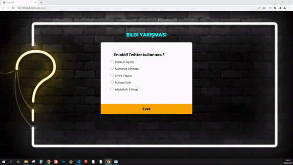

<h1>Quiz App</h1>
<h3>Kullanılan Teknolojiler</h3>
<h4>JS - HTML5 - CSS3</h4>

Sistem içerisindeki 5 soruluk ve 5 şıklı soruları kullanıcı arayüz ekranına basıp kullanıcının seçtiği cevaplara göre ilerleyerek test sonucunda doğru cevapları 100 üzerinden değerlendirerek toplamı yazar ve kullanıcının tekrar sınav sorularına dönebilmesi için dinamik yapıya sahib bir kod yapısını içermektedir 

<a href="https://quiz-app55.netlify.app/">Canlı Ön izlme</a>

